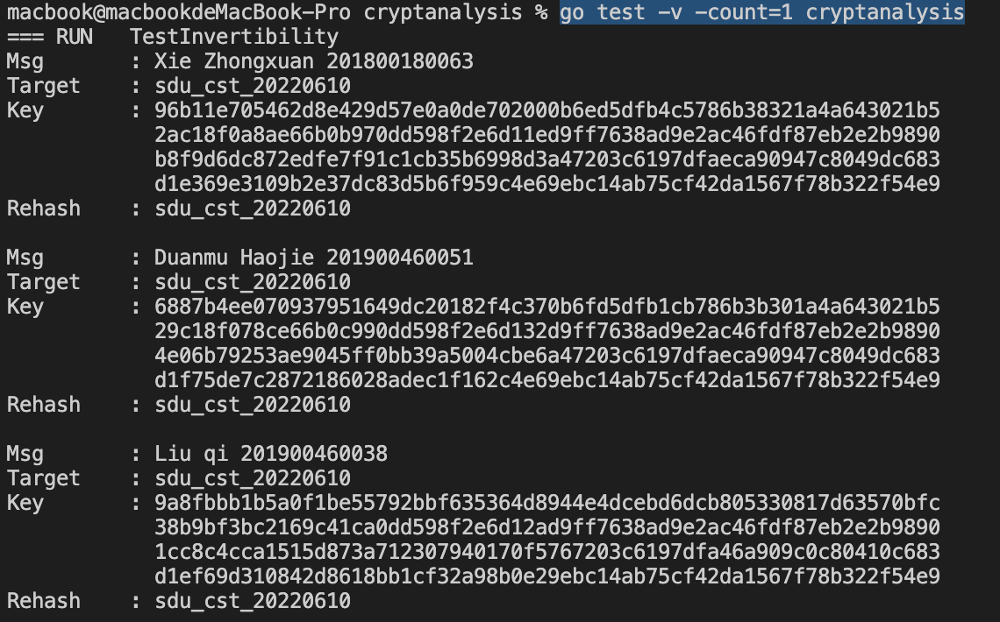

# Cryptanalysis

## Use

```bash
go test -v -count=1 cryptanalysis
```

## Introduction

It looks like a golang implementation, but it's not. Because I am not very interested in cryptanalysis, I did not intend to do this project. But I happen to see two golang implementation of meow hash [quillaja](https://github.com/quillaja/meow) and [stripedpajamas](https://github.com/stripedpajamas/meow-hash-go). The first one wraps the original ``c`` version and the second one embeds ``assembly`` code. So it triggers my interest of how to invoke other language in golang.

So the core attack code is done in ``c`` language( in        ``meow.go``), but wraped in a go function  ``HashSeedInv``.
**All the code is based on the original ``c`` library [meow hash](https://github.com/cmuratori/meow_hash).**

## Description

The overall attack function is:

```c
void MeowHashInv(void* hash,meow_umm Len, void* SourceInit, void* seed)
```

Basically the inversion of original function ``MeowHash``, the hash is padding to 128bytes, the calculate all the way up. The absorb part should deal with the message from tail to front, but since our targeted message is short(student number + name), I simply remove the absorb part.

The following two are order-inversion of  original function ``MEOW_SHUFFLE`` and ``MEOW_MIX_REG``

```c
#define MEOW_SHUFFLE_INV(A,B)
#define MEOW_MIX_REG_INV(A,B)
```

The tricky part is this following function:

```c
#define aesdec(A, B)  A = _mm_aesdec_si128(A, B)
```

At first I think ``#define aesenc(A, B)  A = _mm_aesenc_si128(A, B)`` is the invert of ``aesdec``, but clearly it's wrong. According to [Intel intrinsics-guide](https://www.intel.com/content/www/us/en/docs/intrinsics-guide/index.html), they are respctively

```c
_mm_aesdec_si128
a[127:0] := InvShiftRows(a[127:0])
a[127:0] := InvSubBytes(a[127:0])
a[127:0] := InvMixColumns(a[127:0])
dst[127:0] := a[127:0] XOR RoundKey[127:0]

_mm_aesenc_si128
a[127:0] := ShiftRows(a[127:0])
a[127:0] := SubBytes(a[127:0])
a[127:0] := MixColumns(a[127:0])
dst[127:0] := a[127:0] XOR RoundKey[127:0]
```

And according to [m1el](https://m1el.github.io/refterm-hash/), the invert of ``aesdec`` in ``AES-NI`` intrinsics can be:

```c
#define aesenc(A, B)  \
A = _mm_xor_si128(A, B); \
zero = _mm_setzero_si128(); \
A = _mm_aesenc_si128(_mm_aesdeclast_si128(A, zero), zero); \
A =  _mm_aesenclast_si128(A, zero);
```

Above code actually should be called ``aesdecinv``, but it still named ``aesenc`` simply because I don't want to change my code anymore🙂️.

## Result


