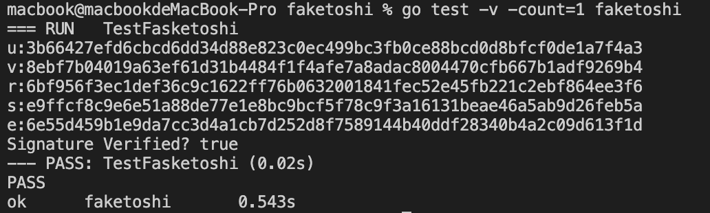
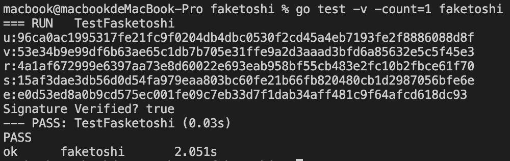

# Faketoshi

## Use

The general idea is the same as project ``sig-pitfall -> TestUncheckm func``. The publickey is extracted from [genesis block](https://www.blockchain.com/btc/block/000000000019d6689c085ae165831e934ff763ae46a2a6c172b3f1b60a8ce26f). The secp256k1 curve and ecdsa verify function are from golang library [btcec](github.com/roasbeef/btcd/btcec).

```go
go test -v -count=1 faketoshi
```

## Some Results


```blank
=== RUN   TestFasketoshi
u:d3d7bca5f89683b6cabba1cba463a237f116e1477cdf27309ada82ccda11a5e8
v:f8b75a0ca9db5c0e6f5b74d28730bf0b12efaca8be3ae5bfca487d38a815ed4f
r:56fb9448011697ac0372bf8206e87e98963393d56b3be393e6138f2d4383841
s:70ab9f1f7ef685ebb747bc58b761b3e20771480ab5586a17188ed6394ddef2ed
e:9058deb1e88ab34576c27872a1a7949f6eebff692c8f110dad01944cc8d52d01
Signature Verified? true

=== RUN   TestFasketoshi
u:c8e76328990b1d96dc52a07797dc155cb33b666204da3255957a22a62dd9a38
v:768de09802dcbf089f82f94a5552571e7fb0bc8866683b5203859df4616d2b66
r:2c9f133cd77ac5e9ea584235ad39b1582effe7eb5600a6cf4004cfa5aac2c0d2
s:86a70932fbf6ee4ed5c9bc39480ec462df944cb83959e9e6152425ac1c6c1c9e
e:503fa14c7600dc18bcc4a388033397cdc95d2af63eacaadd7b394832d77cf869
Signature Verified? true

=== RUN   TestFasketoshi
u:9b710b1810034211f886ef41d6345b5b43c220e14ced843482e7446951289f07
v:245539152469ba04489315c470b5eab5cd817e013a8b43925e641c7651d9bba1
r:573e057b69ca2259fc2183f3c3845a7989052af30854efc3315e283214a55a83
s:dfc57f810a4a9fc57330ccf4d0e3b6d520d1837277785aa99af75709ce338e13
e:187a384026eb7e7d5b25a34fb671ba97329a859320092f8593eedb4d9340f294
Signature Verified? true
```


