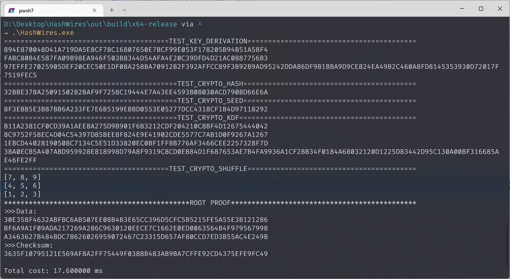

## HashWires impl

> a HashWires one-time range proof can be just 177 bytes for 32-bit ranges (Vs. 608 bytes in Bulletproofs), while for 64-bit numbers a HashWires proof is 369 bytes (Vs. 692 bytes in Bulletproofs). Performance-wise, carefully selected settings for HashWires allow for 60 times faster proof generation, while verification can be up to 30 times more efficient than a Bulletproofs equivalent range proof.

### Usage

代码依赖两个第三方库：

- `fmt`用于格式化输出和调试
- `libsodium`用于提供hash算法

在cmake中使用`find_package`搜寻，因为平台适配和体积原因，没有上传第三方库的依赖和编译好的库文件(如果需要可以联系我提供😊)，需要使用者自行安装这两个库，可以使用`vcpkg`，windows下安装命令如下：

```shell
vcpkg install fmt:x64-windows
vcpkg install libsodium:x64-windows
```

如果不使用vcpkg，也可以自行编译安装后，把import库放在文件夹`lib/win/x64debug`和`lib/win/x64release`下，对于其它平台同理。运行时需要`dll`和可执行文件在同一目录(显然😁)，对于其它平台同理。


build步骤如下：

```shell
mkdir build
cd build
cmake ..
make
```



### Feature

- `crypto_hash`目前底层使用`sha256`实现，未来考虑拓展接口支持自定义hash function
- `crypto_shuffle`目前使用了简单的压缩256 bits到64 bits作为seed，然后调用C++标准库的`std::shuffle`进行shuffle，这一步理论上来说不安全，未来考虑更换

### TODO

- [ ] 原论文使用了AVX优化，后续考虑增加支持
