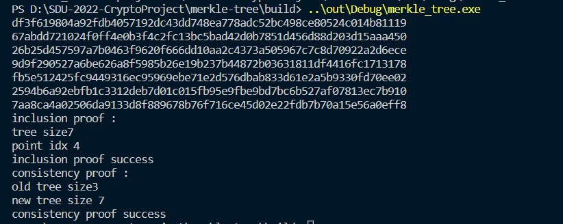

## 简介
merkle tree 实现
c++ 实现RFC 6962 中的 merkle tree
- [x] basic merkle tree
- [x] inclusion proof
- [x] consistency proof   
## 依赖库
- OpenSSL $\geq $ 1.10

## 使用说明
```shell
mkdir build
cd build
cmake .. -DCMAKE_BUILD_TYPE=Release	# Release mode
cmake .. -DCMAKE_BUILD_TYPE=Debug	# Debug mode
make
```
## 运行截图


## 贡献
刘齐：c++ merkle tree 的实现


