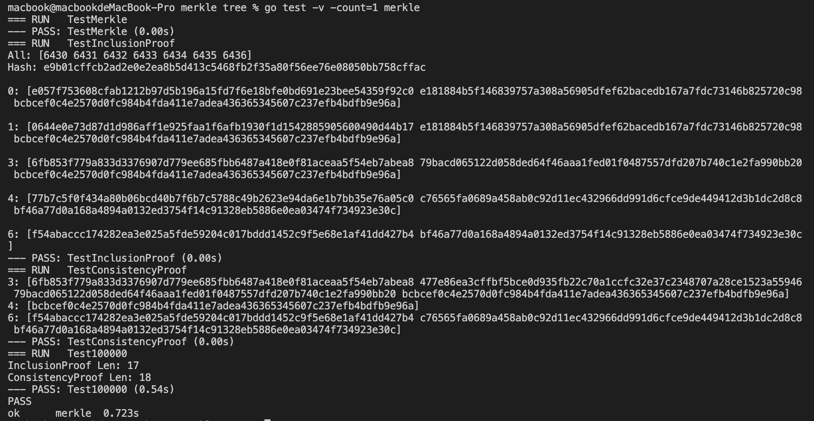

# Merkle go

## Use

```go
go test -v -count=1 merkle
```

## Description

The struct merkle define 2 elements.

```go
type merkleTree struct {
 Node   [][]byte
 hasher hasher.Hasher
}
```

- ``Node``: an array included all original data(each data is a ``[]byte``).
- ``hasher``: the hash strategy(by default using ``sm3``)
  - In [RFC6962](https://tools.ietf.org/html/rfc6962)  2.1 section ->  **"The hashing algorithm is SHA-256 [FIPS.180-4] (note that this is fixed for this experiment, but it is anticipated that each log would be able to specify a hash algorithm)."** So we make the hash algorithm be flexible.

And ``merkleTree`` have mathod ``InclusionProof``and ``ConsistencyProof``, which implement **section 2.1.1.  Merkle Audit Paths** and **section 2.1.2.  Merkle Consistency Proofs respectively**.

## Result

In merkle_test.go, we test the correctness of ``InclusionProof``and ``ConsistencyProof``. And in ``Test100000`` we generate a merkle tree with 100000 node, and figure the proof length.

