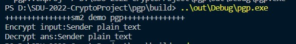

## 简介
使用sm2 算法实现PGP协议流程

## 依赖
- OpenSSL $\geq $ 1.10 

## 使用说明
```shell
mkdir build
cd build
cmake .. -DCMAKE_BUILD_TYPE=Release	# Release mode
cmake .. -DCMAKE_BUILD_TYPE=Debug	# Debug mode
make
```

## 运行截图


## 贡献
刘齐：PGP协议流程实现