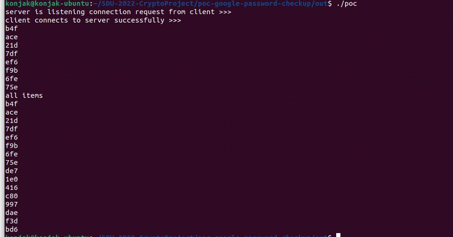

## 简介

基于SM2椭圆曲线的ECDH 和 SHA256 安全哈希算法，构建的简单的PSI协议。

-  CPP  version 
   - [x] basic SM2 DDH PSI protocol
   - [x] communication API Between Server and Client
   - [x] argon2 password hash
 

## 使用说明
### 依赖库
- OpenSSL $\geq$ 1.10
- Argon2
  -  [Password Hashing Competition(PHC)](https://password-hashing.net) winner argon2
  - argon2 已经配置在项目中
### libargon2正常
``` shell
mkdir build
cd build
cmake .. -DCMAKE_BUILD_TYPE=Release	# Release mode
cmake .. -DCMAKE_BUILD_TYPE=Debug	# Debug mode
make
```
### libargon2 无法使用
```shell
git submodule init && git submodule update
cd phc-winner-argon2
make
cp libargon2.a ../lib/linux/ 
cp include/argon2.h ../include
cd .. 
mkdir build
cd build
cmake .. -DCMAKE_BUILD_TYPE=Release	# Release mode
cmake .. -DCMAKE_BUILD_TYPE=Debug	# Debug mode
make
```
### 运行截图


### 贡献
刘齐：poc google password checkup 实现

