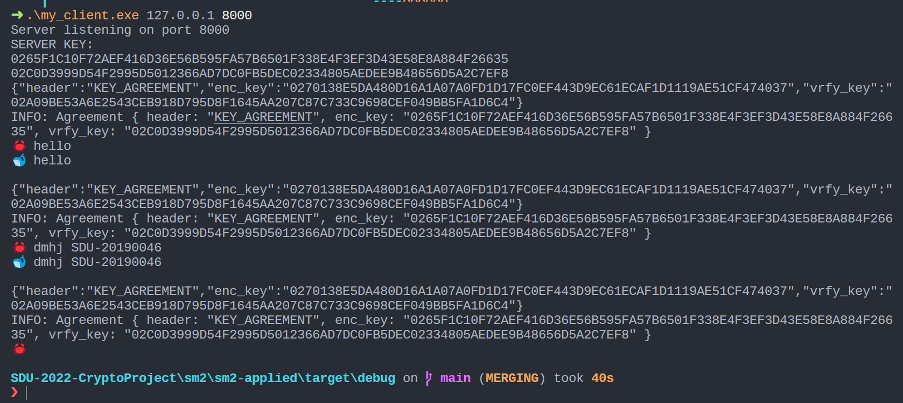

## Usage

`cargo test`执行单元测试，`cargo run`启动命令行程序

```
cargo test
cargo build --release
```

build后在`target/release`文件夹中找到可执行文件，命令行参数传入IP和port即可（有命令行提示）。

注意默认情况下是一个简单的 echo 服务器， 我还实现了其它几个服务，如HTTP等，可以修改源码中的register，修改对应的回调函数测试相应的效果。

如：`my_client.exe 127.0.0.1 8000`：



## Feature

- 多线程server
- 自定义了密钥协商协议，在建立session时通过两次交互获得对方信息，协议内容见注释
- 自定义了序列化消息传输协议，依赖第三方库`serde`（Rust中常用的序列化"标准库"）
- 选择`sm2_server`时，所有的消息经过SM2加密，签名
- 以一个简单的命令行传递消息（自选server handler）为例

## TODO

- [ ] 当前使用的第三方库`libsm`存在严重效率问题，后续考虑替换成自己实现的SM2
- [ ] 添加合适的handler做一个实际场景的应用
- [ ] 做一个可视化前端
- [ ] 在此基础上实现PGP

