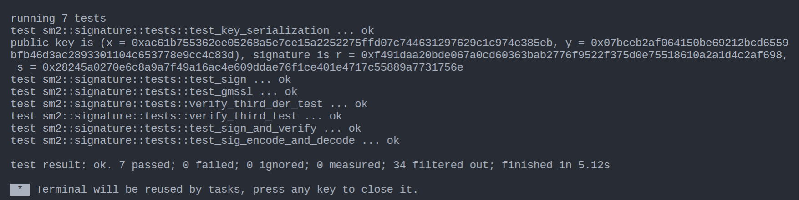

`sm2` 曲线自己造的轮子，从有限域到椭圆曲线群，仅使用Montgomery-reduction进行优化，其它都是朴素算法，没有考虑侧信道

不依赖`RustCrypto`的曲线接口，独立实现的自己的接口，虽然`RustCrypto`几乎可以说是rust语言加密这部分的"官方库"，但是目前的实现与"官方"库并不兼容。。。主要原因是那个代码太复杂了，后续再考虑适配。

目前只实现了签名，加密部分尚未完成

- 运行测试：

```bash
cargo test
```


