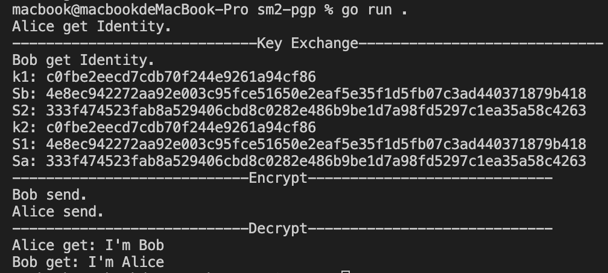

# SM2-pgp

## Use

```go
go run .
```

## Description

This project aiming at giving a demo of sm2-pgp scheme. We use **goroutines** to simulate 2 users and **channel** to send data between 2 users.

Next we explain the scheme in userA's view.

### Step 1. Get Indentity

```go
 Alice, _ := user.NewEntity("Alice", "", "Alice@gmail.com")
```

``user`` is a struct defined in user.go, which includes the information and ``sm2.PublicKey`` and ``sm2.PrivateKey``.

```go
type Entity struct {
 UserId *UserId
 Pub    sm2.PublicKey
 Priv   sm2.PrivateKey
}
```

### Step 2. Key Exchange

According to the sm2 key exchange scheme, userA generate random number $R_A$ and send necessary pubkey to userB. We simulate the data exchange by sending local data to channel ``_ida,_da,_ra``.

```go
 rapriv, _ := sm2.GenerateKey(rand.Reader)
 ida := []byte(Alice.UserId.Id)
 da := &Alice.Priv.PublicKey
 ra := &rapriv.PublicKey
 _ida <- ida
 _da <- da
 _ra <- ra
```

UserA get UserB's pubkey in channel ``_idb,_db,_rb``

```go
 idb := <-_idb
 db := <-_db
 rb := <-_rb

```

The UserA can calculate the session key.

```go
 k2, S1, Sa, err := sm2.KeyExchangeA(16, ida, idb, &Alice.Priv, db, rapriv, rb)
```

### Step 3. Encrypt session key

We use ``k`` generate in step2 as session key. And ``db`` is the pubkey of userB, encrypt session key as following.

```go
enck, err := sm2.EncryptAsn1(db, k2, rand.Reader)
```

### Step 4. Encrypt message

Messages are encrypted using any symmetric encryption scheme, here we use ``sm4``

```go
cipher, err := sm4.Sm4OFB(k2, msg, true)
```

### Step 5. Decrypt message

After receiving the encrypted session key and cipher in channel, userA can get plaintext.

```go
 cb := <-_cb
 kb := <-_ekb
 sessionkey, err := sm2.DecryptAsn1(&Alice.Priv, kb)
 plaintext, err := sm4.Sm4OFB(sessionkey, cb, false)
```

## Result

note: because we use the concurrently goroutines, the printed program result can be a little bit unordered. But the channel will be blocked before data been sended, so the correctness of program can be guaranteed.

