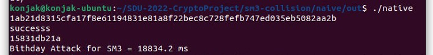
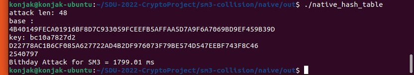
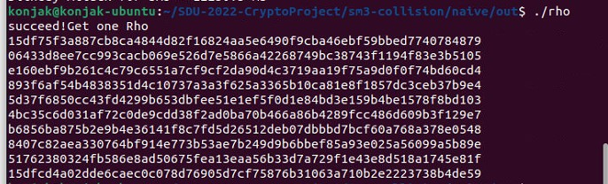

##  简介
Rust 和 c++ 两种语言对于SM3的碰撞攻击，包括生日攻击和rho 攻击
## 依赖库
- OpenSSL $\geq$ 1.10
- GmSSL
- Openmp
- 
## 使用说明
### c++ version
```shell
cd cpp-native-rho
mkdir build
cd build
cmake .. -DCMAKE_BUILD_TYPE=Release	# Release mode
cmake .. -DCMAKE_BUILD_TYPE=Debug	# Debug mode
make
```
### rust version
```shell
cd rust-native-rho
cargo b --release
cargo r
```
## 运行截图
### c++ 生日攻击

### c++ 生日攻击 哈希表

### c++ rho

### rust 生日攻击


### 贡献
- 刘齐：c++ 版本攻击方法的实现与测试、文档修改
- 端木浩杰：
