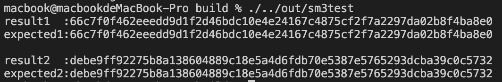

# sm3-cpp

## Use
```shell
mkdir build
cd build 
cmake ..
make
./../out/sm3test
```

## Description

This project implement sm3 in cpp. It follows the coding style of openssl/include/sha.h, and gives and struct ``SM3_CTX`` which is similar to ``SHA256_CTX``. So the interfaces of this sm3-cpp can be basically keep the same with ``sha256`` is openssl.

## Result

