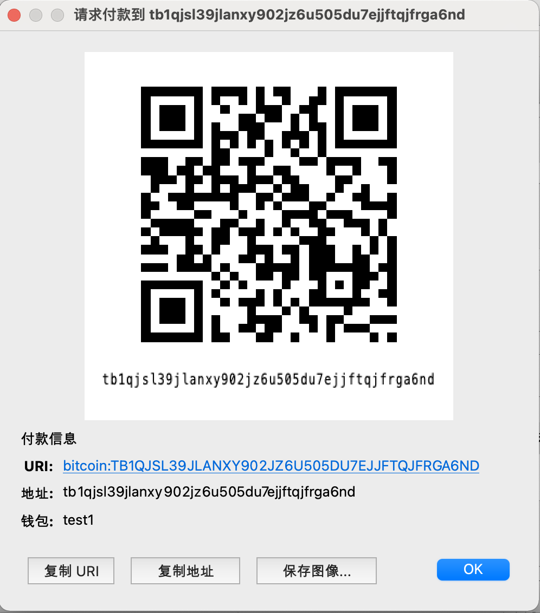
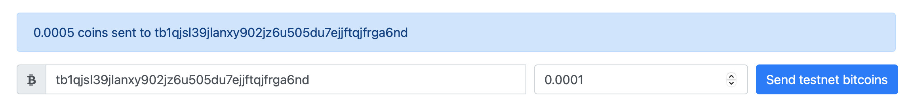
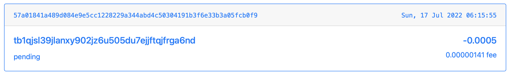
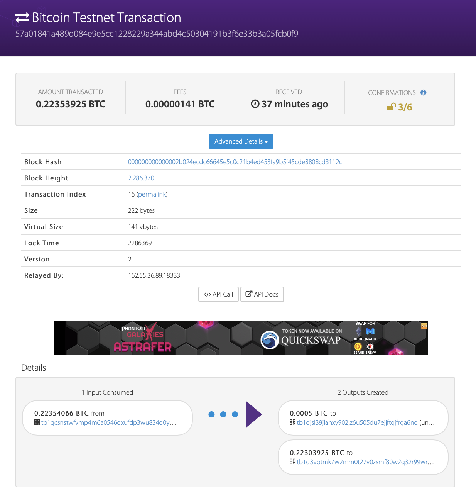
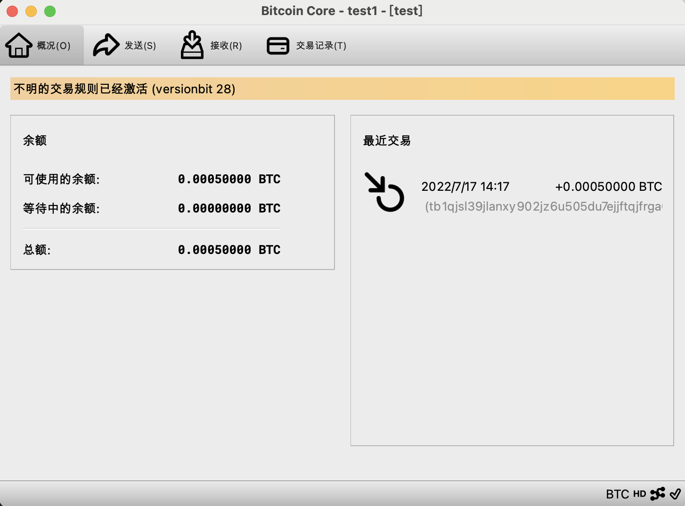
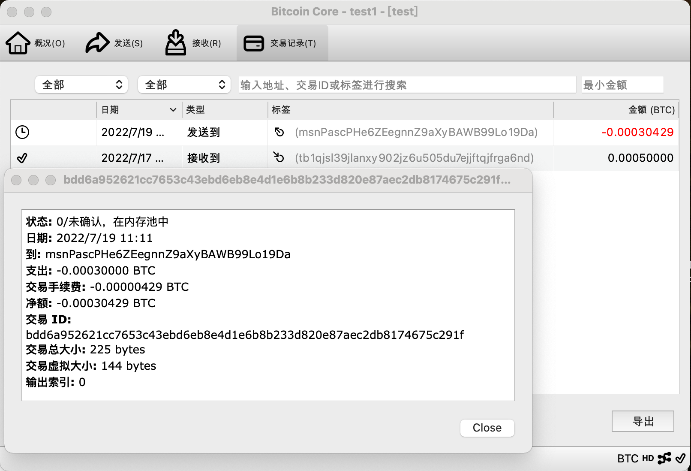
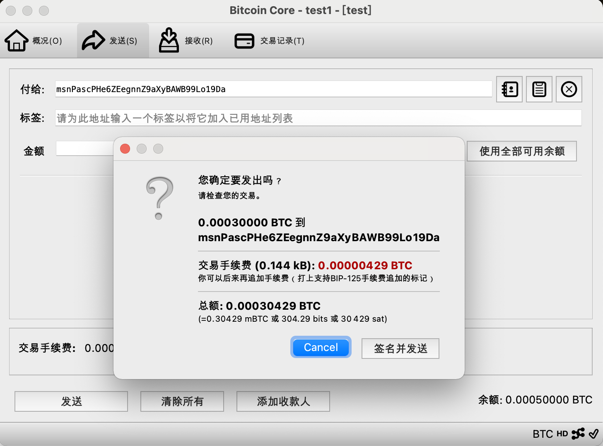
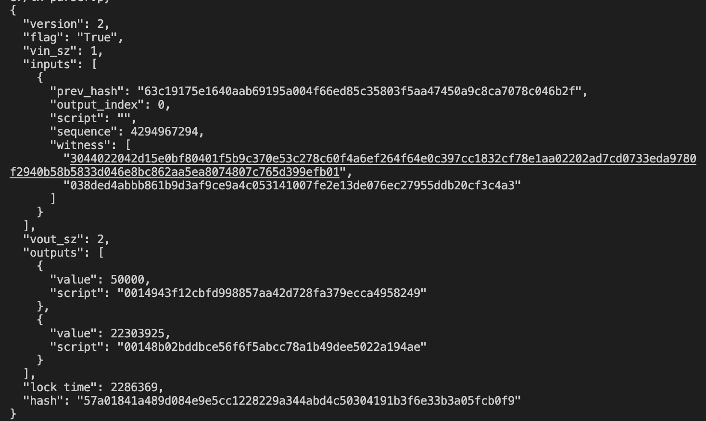
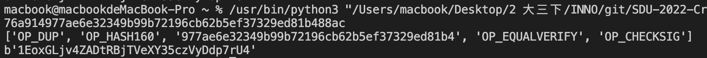

# tx-parser

## 1. Send a tx on Bitcoin testnet

### Step1: Get a bitcoin testnet address

We use bitcoin core[test] to generate testnet address. In this test the private key is tb1qjsl39jlanxy902jz6u505du7ejjftqjfrga6nd.

### Step2: Require bitcoin testnet coins

Require 0.0005 testnet coins to tb1qjsl39jlanxy902jz6u505du7ejjftqjfrga6nd in website <https://bitcoinfaucet.uo1.net>.

The transaction detailed can be viewed in <https://live.blockcypher.com/btc-testnet>.

### Step3: Sending bitcoin testnet coins

After sychronized with the Bitcoin testnet(about 40G, using 2 days), we can then create a transaction.
In the wallet we can see 0.0005 testnet coins from previous transaction.

Fill in the address, then a transaction is created.

The transaction can be seen online <https://live.blockcypher.com/btc-testnet/tx/bdd6a952621cc7653c43ebd6eb8e4d1e6b8b233d820e87aec2db8174675c291f/>.

<!-- ### Step3: Send coins on testnet -->

## 2. Parse tx

We parse tx based on the struct <https://en.bitcoin.it/wiki/Protocol_documentation#tx>
And to varificate correctness, we keep identical json key with <https://live.blockcypher.com/> api.

### 2.1 Implementation

- ``byte2intLittle`` Convert a little-end bytcode to an integer with given length, for example ``byte2intLittle('02000000')  = 2``
- ``compactSizeParser``  As defined by <https://developer.bitcoin.org/reference/transactions.html#compactsize-unsigned-integers>, every var-int is handled by ``compactSizeParser`` method.
- ``txinParser`` parese the txin struct.
- ``txoutParser`` parese the txoutstruct.
- ``transactionParser`` parse the whole tx struct.

### 2.2 Additional

- ``sha256d`` calculate the double-time sha256, and we add the transaction hash information.

### 2.3 Result

The example transaction is the transaction in step2.
The detailed information: <https://api.blockcypher.com/v1/btc/test3/txs/57a01841a489d084e9e5cc1228229a344abd4c50304191b3f6e33b3a05fcb0f9?includeHex=true>
The following result is competely same as above what above website shows, except those additional computed infomation.

And tx-parser can also deal with other bitcion transactions bytecode.

Here's another example in step3. the prev_hash is exactly the same with that in step2.

## 3. Parse script

### 3.1 Implementation

- ``scriptparser`` parse the script separate from transaction.
- ``hash160_to_address`` calculate checksum and add prefix of the hash160 value which separated from script, then turn it into a address.(Version1 address only, segwit unsupport)

### 3.2 Result

